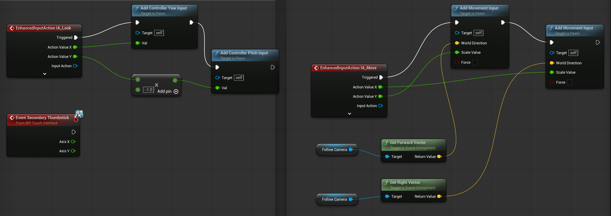
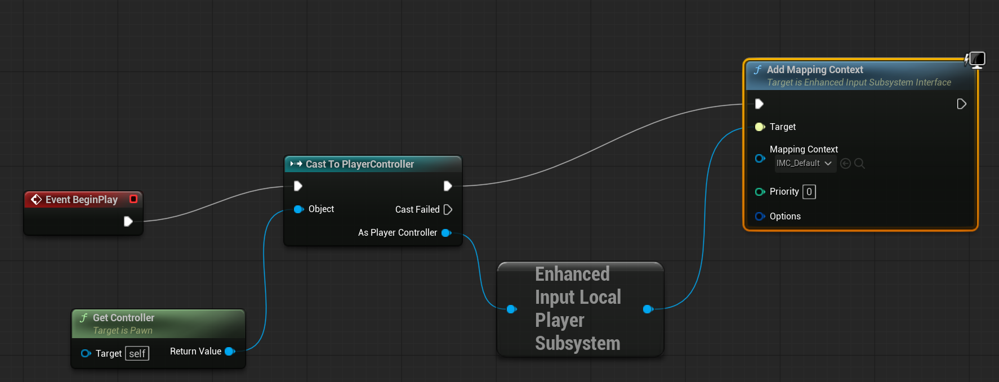
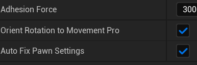

# OmniWalk 0.1 | Arbitrary Gravity Framework for UE5
     [](https://ko-fi.com/C0C616ULD4)


**OmniWalk** is a high-performance C++ middleware framework designed to solve the technical "Showstoppers" of non-Z-up locomotion in Unreal Engine. It delivers a "Zero-Config" solution for Ratchet & Clank style surface adhesion on arbitrary meshes.

Active development & some bugtesting continues on both the present MIT version and the Fab version, but only [the Fab version is production-ready at all times](https://www.fab.com/listings/6bced904-37bf-414c-9a28-dca6744e7c22).

[Example video 1](https://youtu.be/e60EJlt1yX8) <br>
[Update video 1](https://www.youtube.com/watch?v=Hije7duQDKY) <br>
[Update video 2](https://youtu.be/k1NvjIcgSg0) <br>
[Update video 3](https://www.youtube.com/watch?v=WidN3t839Uc)
<br>
[Manual](https://gregorigin.com/OmniWalk/) <br>
[Extension Modules Manual](https://gregorigin.com/OmniWalk_Extension/) <br><br><br>

| <i><b>Comparison | <i><b>GitHub version (0.1 MIT)           | <i>FAB edition (0.5+ Closed)</b></i>                |
|:---|:---|:---|
| **Version** | Core | Fully featured + updated |
| **Distribution** | Source only | Binaries, vetted by Epic |
| **Engine support** | UE 5.7.0 | UE 5.6 - 5.7.2+ |
| **Gravity-relative camera** | Included | Included |
| **Angle handling** | Included | Included |
| **Arbitrary gravity, Wall walking** | Included | Included |
| **Wall sliding with input resistance** | n/a | Included | 
| **Dedicated dismount & Sprinting** | n/a | Included |
| **Grace periods, Coyote time** | n/a | Included |
| **Planetary gravity** | n/a | Included as subsystem | 
| **Spider Walk / Convex Traversal** | n/a | Included |
| **4 Magnetic Boots States** | n/a | Included |
| **Volumetric Gravity System** | n/a | Included |
| **Trigger Zones** | n/a | Included |
| **Physics Field** | n/a | Included |
| **Replication** | n/a | Included |
| **Code Access** | Public scripts | Full implementation + samples |
| **Updates** | n/a | Regular, vetted by Epic |
| **Quality Assurance** | GitHub Issues | Vetted by Epic, tested by author |
| **Support** | GitHub Issues | Forum & Email |


## 🚀 Key Technical USPs

- Arbitrary surface walking by driving SetGravityDirection from live surface normals (walls, ceilings, spheres).
- Surface detection and transition logic (multi‑point traces, wall detection, normal averaging, cooldown smoothing).
- Adhesion force to prevent popping off convex or inverted geometry.
- Gravity‑relative input mapping so movement aligns to the camera on any surface.
- **Native 5.4+ Integration:** Deeply integrated with `UCharacterMovementComponent::SetGravityDirection` for frame-perfect physics integration.
- **The "Singular Component":** No-code setup. Automatically hijacks Pawn settings, stabilizes camera gimbals, and remaps input vectors to surface planes.
- **Gimbal-Free Solver:** Custom camera modifier logic eliminates control inversion and view-locking at ±90° pitch.
- **Surface-Projected Input:** Intercepts and re-projects movement inputs onto triangle normals to prevent "capsule pinning" against vertical walls.
- **Slate Telemetry:** Dedicated editor debugger for real-time visualization of gravity vectors and alignment quality.
- Strafe/Follow toggle that works correctly under arbitrary gravity.
- Auto‑injection via tags for no‑code adoption in levels.
- Editor tools (example level generator, debugger telemetry).

## 📁 Repository Structure
````
OmniWalk/
├── Source/
│   ├── OmniWalk/       # Runtime Module (Adhesion & Input Hijacking)
│   └── OmniWalkEditor/ # Editor Module (Slate UI & Telemetry)
├── Resources/          # Icons and Visual Assets
├── Content/            # UI Styles and Prototype Blueprints
└── OmniWalk.uplugin    # Descriptor# OmniWalk
Zero-Config Arbitrary Gravity &amp; Surface Adhesion Framework for UE5.4+. Native C++ "Magneboot" locomotion with gimbal-free camera stabilization.
````

## 🛠 Setup and Usage

In UE 5.7, please setup your Character like this: 




  Add Component: Attach UOmniWalkPro to any ACharacter.

  Tag (Optional): Add actor tag OmniWalk.Enabled for subsystem auto-injection.

  Play: Move toward any surface. The framework handles orientation, gravity redefinition, and camera stabilization automatically.

To toggle between Strafing (facing camera) and Orient to Movement (facing travel), please use the <i>Orient Rotation To Movement</i> switch on the component.




## 🧠 Architectural Insights

OmniWalk ticks in the TG_PrePhysics group, ensuring that the redefined gravity vector is utilized by the CharacterMovementComponent during the current frame's integration. It utilizes Slerp-normalized Quaternions for orientation to avoid Euler singularities inherent in traditional platformer movement.

## 📄 License

Distributed under the MIT License. See LICENSE for more information.
